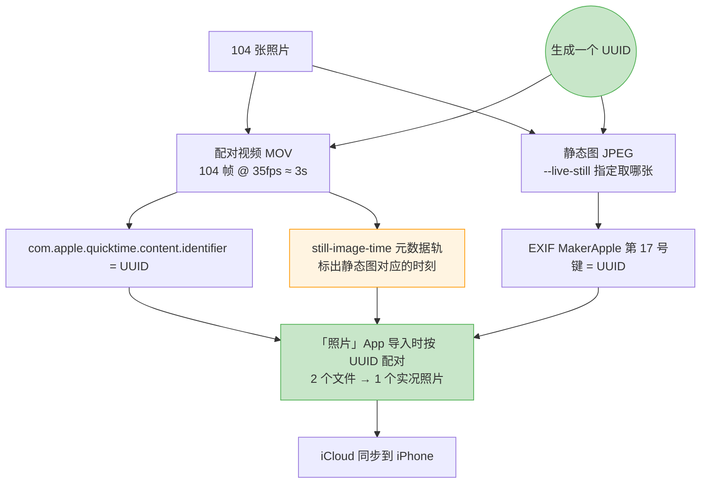

# photo2video

把有序照片快速合成 **iPhone 实况照片**、延时视频或幻灯片。直接读 macOS「照片」App 的图库，不用手动导出。

## ✨ 核心特性

- **实况照片原生支持**：104 张照片 → 1 个 3 秒实况照片，按 UUID 正确配对，直接导入「照片」App
- **全自动文件名**：按起止照片名自动生成输出文件 (如 `P001-P104.mov`)，无需指定 `-o`
- **智能图片适配**：自动检测 EXIF 旋转，`native` 模式按长边对齐，横竖图都不裁切
- **大量照片拆分**：`--live-split 30` 一键生成多个实况照片，自动切分和命名
- **完整 EXIF 保留**：静态图采用 ImageIO，保持源图的 GPS、相机参数等全部元数据
- **帧级精确时长**：Bresenham 算法均衡分摊，支持 `--photo-fps` / `--per-photo` / `--total` 三种时长控制
- **内容缓存**：相同参数复用中间帧，热启动 4.3 秒，冷启动 10.6 秒

## 👥 适用场景

- 📸 **摄影师/内容创作者**：将连拍照片序列转成 iPhone 实况照片发布或备份
- 🎬 **延时摄影爱好者**：快速生成延时视频，按张数或时长控制  
- 🖼️ **幻灯片制作**：每张照片固定显示时长，支持添加背景音乐
- 🔄 **照片库迁移**：保留 EXIF 和自动化流程，批量处理 100+ 张照片

## 🚀 快速开始

### 安装

```bash
git clone https://github.com/your-repo/photo2video.git
cd photo2video
uv sync
```

### 最简单的例子：生成实况照片

```bash
# 从照片 App 读取 P1001222 到 P1001325 这 104 张，生成实况照片并自动导入
uv run photo2video --range P1001222-P1001325 --live-photo --import-to-photos

# 输出文件自动命名为: P1001222-P1001325.mov (源图原始尺寸，不缩放)
# 静态图自动取第一张 P1001222.JPG，完整保留 EXIF
```

### 图片太多？自动拆分

```bash
# 104 张照片 → 拆成 4 个实况照片(每组 30 张)
uv run photo2video --range P1001222-P1001325 --live-photo --live-split 30 --import-to-photos

# 输出:
# P1001222-P1001251.mov (30 张, 3s)
# P1001252-P1001281.mov (30 张, 3s)
# P1001282-P1001311.mov (30 张, 3s)
# P1001312-P1001325.mov (14 张, 2.8s)
```

### 生成延时或幻灯片视频

```bash
# 延时：12 张/秒 → 9 秒视频
uv run photo2video --range P1001222-P1001325 --photo-fps 12 -o timelapse.mp4

# 幻灯片：每张 2 秒显示，带模糊背景
uv run photo2video --input-dir ~/Desktop/pics --per-photo 2 --fit blur -o slides.mp4
```

## 📁 项目结构

```
photo2video/
├── photo2video/          # 核心模块
│   ├── cli.py           # 命令行入口，分组拆分逻辑
│   ├── prepare.py       # 并行缩放、EXIF 旋转识别
│   ├── render.py        # ffmpeg 编码、清单生成
│   ├── timing.py        # 时长分配（Bresenham 算法）
│   ├── sources.py       # 照片来源：照片库 / 文件夹 / osxphotos
│   └── livephoto.py     # 实况照片配对（调用 Swift helper）
├── swift/
│   └── livephoto.swift  # 实况照片打包（UUID、EXIF、元数据轨）
├── tests/               # 单元 + 集成测试（70+ 用例）
└── pyproject.toml       # uv 依赖管理，无运行时依赖
```

## 📖 详细指南

### 实况照片工作原理

实况照片 = 「静态图 JPEG」+ 「配对视频 MOV」靠 UUID 绑定：



这些字段是从本机图库里**真实 iPhone 实况照片上逆向确认的**，不是猜的。生成后在图库里校验 `ZPLAYBACKSTYLE=3`，和原生实况照片一致。

### 画面适配（`--fit`）

源照片可能是横向 (6000×4000) 或竖向 (4000×6000)，处理时选择：

| 模式 | 效果 | 适用 |
|------|------|------|
| `cover` (普通视频默认) | 等比放大铺满，居中裁掉超出部分 | 全平台播放最干净 |
| `contain` | 完整画面 + 黑边 | 不能损失任何画面 |
| `blur` | 完整画面 + 模糊背景填充 | 社交平台观感好 |
| `native` (实况照片默认) | 按长边对齐预设尺寸，自动适配横竖图，不裁不填 | 保持原始比例 |

`native` 模式：预设 `4k` 时长边对齐到 3840 像素，横向源图宽=3840(推导高)，竖向源图高=3840(推导宽)。

### 主要选项

| 选项 | 默认 | 说明 |
|------|------|------|
| `--fps` | 30 | 输出视频帧率，与照片切换速度解耦 |
| `-r/--resolution` | source | `source`(原图尺寸,不缩放) / `4k`/`2k`/`1080p`/`720p` 或 `1920x1080` |
| `-o/--output` | 自动 | 输出路径；不填则按起止文件名自动生成 |
| `--codec` | h264 | h264 兼容性最好；h265 体积小 |
| `--crf` | 18 | 画质，越小越好 |
| `--hw` | 关 | VideoToolbox 硬件编码，快但同码率画质略差 |
| `--deflicker [N]` | 关 | 消除延时摄影的逐帧亮度跳变 |
| `--audio` | 无 | 背景音乐，自动裁到视频长度并淡出 |
| `--preview [N]` | 关 | 只用前 N 张快速验证 |
| `--dry-run` | 关 | 只打印 ffmpeg 命令，不执行 |

### 实况照片专有选项

| 选项 | 默认 | 说明 |
|------|------|------|
| `--live-photo` | 关 | 生成实况照片而不是普通视频 |
| `--live-still` | first | 静态图取哪张：`first`/`middle`/`last` 或具体文件名 |
| `--live-duration` | 3.0 | 目标时长，自动算帧率让每张照片正好占 1 帧 |
| `--live-split` | 0 | 每 N 张照片生成一个实况照片，按顺序切分 |
| `--import-to-photos` | 关 | 生成后自动导入「照片」App |

### 时长控制（三选一）

```bash
# 方式 1：指定照片频率
--photo-fps 12          # 每秒 12 张照片（延时首选）

# 方式 2：指定单张时长
--per-photo 3           # 每张显示 3 秒（幻灯片首选）

# 方式 3：指定总时长
--total 20              # 整段正好 20 秒，均分给所有照片

# 叠加：逐张覆盖
--durations times.csv   # CSV: 文件名,秒数，可覆盖单张时长
```

## 💡 常见问题

**Q: 为什么我的竖向照片缩放后还是被裁切了？**
A: 检查 `-r/--resolution` 默认值。如果用了 `1080p`，宽度会被锁到 1920。改用 `source`（默认）或加 `-r 4k --fit native` 让竖图自动适配。

**Q: 实况照片导入「照片」App 后没有动画？**
A: 检查静态图和视频是否尺寸一致（都应该是输出宽高）。运行 `ffprobe *.mov` 看分辨率，如果不同，重新生成。

**Q: 100+ 张照片怎么处理？**
A: 用 `--live-split 30` 自动拆分，或用 `--preview 50 --dry-run` 先验证前 50 张效果。

## 🛠️ 开发

### 运行测试

```bash
uv sync
uv run pytest -q
```

### 项目依赖

运行时零依赖。开发时需要：
- Python 3.11+
- ffmpeg 8.1+
- swiftc 6.3+（仅用于实况照片打包）
- macOS 13+（照片库功能）

## 🤝 贡献

欢迎 Issue 和 PR。主要模块：
- 时长算法改进（`timing.py`）
- 新增画面适配模式（`prepare.py`）
- 更多测试用例（`tests/`）

## 📝 License

MIT
