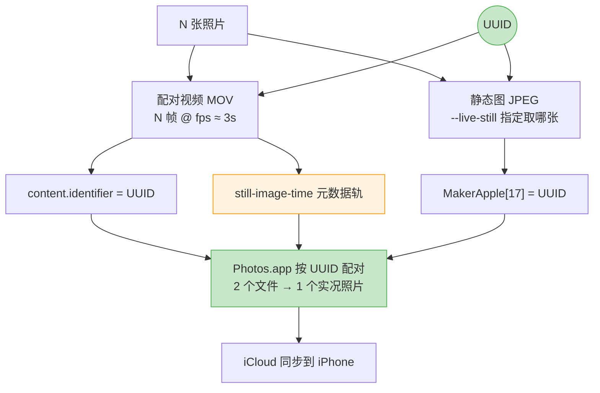

# photos2live

> 把有序照片合成 **iPhone 实况照片**、延时视频或幻灯片。直接读 macOS「照片」App 的图库，不用手动导出。

[](LICENSE)
[](https://www.python.org/)
[](https://www.apple.com/macos/)

```bash
# 安装依赖
brew install ffmpeg
xcode-select --install
git clone https://github.com/your-name/photos2live && cd photos2live && uv sync

# 104 张照片 → 实况照片，自动导入「照片」App
uv run photos2live --range P1001222-P1001325 --live-photo --import-to-photos
```

## ✨ 核心特性

- **实况照片原生支持**：按 UUID 正确配对静态图和视频，Photos.app 识别为真实实况照片
- **完整 EXIF 保留**：静态图用 ImageIO 处理，GPS、相机参数、拍摄时间全部保留
- **智能横竖适配**：自动读取 EXIF 旋转，`native` 模式按长边对齐，横竖图都不裁切
- **大量照片自动拆分**：`--live-split 30` 一键生成多个实况照片，自动切分和命名
- **全自动输出命名**：按起止照片名生成文件名（如 `P1001222-P1001325.mov`），无需指定 `-o`
- **帧级精确时长**：Bresenham 算法均衡分摊，三种时长控制模式（张数/单张时长/总时长）
- **并行缓存**：相同参数复用中间帧，热启动 4.3 秒 vs 冷启动 10.6 秒

## 📦 安装

**前置依赖：**

```bash
brew install ffmpeg          # 视频编码
xcode-select --install       # swiftc，用于实况照片打包
```

**安装工具：**

```bash
git clone https://github.com/your-name/photos2live.git
cd photos2live
uv sync
```

> 没有 `uv`？`brew install uv` 或 `pip install uv`。

**照片库权限（读取「照片」App 时需要）：**

系统设置 → 隐私与安全性 → 完整磁盘访问权限 → 勾选终端。

## 🚀 快速开始

**生成实况照片并导入：**

```bash
uv run photos2live --range P1001222-P1001325 --live-photo --import-to-photos
# 输出: P1001222-P1001325.mov，静态图取第一张，完整保留 EXIF
```

**照片太多，自动拆分：**

```bash
# 104 张 → 4 个实况照片，每组 30 张
uv run photos2live --range P1001222-P1001325 --live-photo --live-split 30 --import-to-photos
# 输出: P1001222-P1001251.mov / P1001252-P1001281.mov / ...
```

**延时视频 / 幻灯片：**

```bash
uv run photos2live --range P1001222-P1001325 --photo-fps 12 -o timelapse.mp4
uv run photos2live --input-dir ~/Desktop/pics --per-photo 2 --fit blur -o slides.mp4
```

**先看效果，不真跑：**

```bash
uv run photos2live --range P1001222-P1001325 --live-photo --dry-run
```

## 📁 项目结构

```
photos2live/
├── photos2live/
│   ├── cli.py           # 命令行入口，分组拆分逻辑
│   ├── prepare.py       # 并行缩放、EXIF 旋转识别
│   ├── render.py        # ffmpeg 编码、concat 清单生成
│   ├── timing.py        # 帧级时长分配（Bresenham 算法）
│   ├── sources.py       # 照片来源：照片库 / 文件夹 / osxphotos
│   └── livephoto.py     # 实况照片配对（调用 Swift helper）
├── swift/
│   └── livephoto.swift  # 实况照片打包（UUID、EXIF、still-image-time 轨）
├── tests/               # 70+ 测试用例
└── pyproject.toml
```

## 📖 参考

### 实况照片原理

实况照片 = 静态图 JPEG + 配对视频 MOV，靠 UUID 绑定。字段从本机「照片」库真实实况照片逆向确认，生成后 `ZPLAYBACKSTYLE=3` 与原生一致。



### 主要选项

| 选项 | 默认 | 说明 |
|------|------|------|
| `--live-photo` | 关 | 生成实况照片 |
| `--live-split N` | 0 | 每 N 张生成一个实况照片 |
| `--live-still` | first | 静态图：`first`/`middle`/`last` 或文件名 |
| `--live-duration` | 3.0 | 目标时长（秒） |
| `--import-to-photos` | 关 | 生成后自动导入「照片」App |
| `--photo-fps N` | — | 每秒放 N 张（延时首选） |
| `--per-photo N` | — | 每张显示 N 秒（幻灯片首选） |
| `--total N` | — | 整段正好 N 秒 |
| `-r/--resolution` | source | `source`/`4k`/`1080p` 或 `1920x1080` |
| `--fit` | native/cover | `native` 不裁切 / `cover` 铺满 / `blur` 模糊填充 |
| `--hw` | 关 | VideoToolbox 硬件编码 |
| `--dry-run` | 关 | 只打印命令，不执行 |

### 常见问题

**竖向照片被裁切？** 加 `--fit native`（实况照片默认已是 native）。

**实况照片导入后没有动画？** 静态图和视频尺寸必须一致，用 `ffprobe *.mov` 检查。

**从文件夹而不是照片库读取？** 加 `--input-dir ~/Desktop/pics`，搭配 `--range` 筛选范围。

**照片有在「照片」App 里做过编辑？** 装 osxphotos 后用 `--source osxphotos` 读编辑后的版本：`uv add osxphotos`。

## 🛠️ 开发

```bash
uv sync
uv run pytest -q
```

运行时零依赖，开发需要 Python 3.11+、ffmpeg 8.1+、swiftc 6.3+、macOS 13+。

## 🤝 贡献

欢迎 Issue 和 PR。

## 📝 License

MIT

