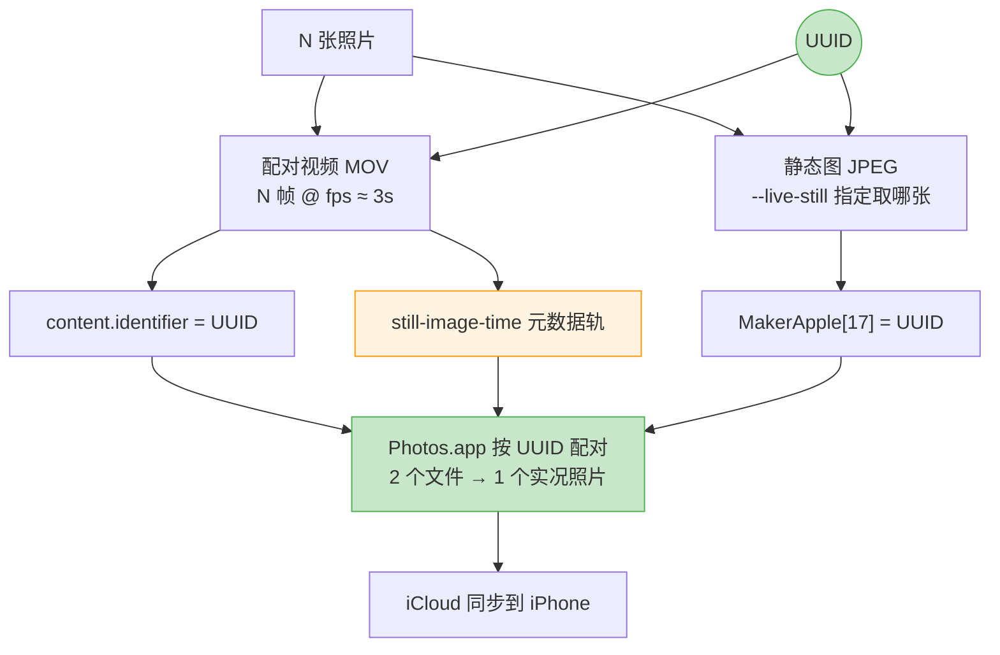

# photos2live

> 把有序照片合成 **iPhone 实况照片**、延时视频或幻灯片。直接读 macOS「照片」App 的图库，不用手动导出。

[](LICENSE)
[](https://www.python.org/)
[](https://www.apple.com/macos/)

```bash
# 安装依赖
brew install ffmpeg
xcode-select --install
git clone https://github.com/your-name/photos2live && cd photos2live && uv sync

# 104 张照片 → 实况照片，自动导入「照片」App
uv run photos2live --range P1001222-P1001325 --live-photo --import-to-photos
```

- **实况照片原生支持**：HEVC `hvc1` 编码，UUID 正确配对静态图和视频，Photos.app 识别为真实实况照片
- **完整 EXIF 保留**：静态图用 ImageIO 处理，GPS、相机参数、拍摄时间全部保留
- **颜色范围自动透传**：探测源图颜色空间（iPhone 原生 full-range），视频编码一致，无亮度跳变
- **智能横竖适配**：自动读取 EXIF 旋转，`native` 模式按长边对齐，横竖图都不裁切
- **大量照片自动拆分**：`--live-split 30` 一键生成多个实况照片，自动切分和命名
- **全自动输出命名**：按起止照片名生成文件名（如 `P1001222-P1001325.mov`），无需指定 `-o`
- **帧级精确时长**：Bresenham 算法均衡分摊，三种时长控制模式（张数/单张时长/总时长）
- **并行缓存**：相同参数复用中间帧，热启动极快

## 📦 安装

**前置依赖：**

```bash
brew install ffmpeg          # 视频编码
xcode-select --install       # swiftc，用于实况照片打包
```

**安装工具：**

```bash
git clone https://github.com/your-name/photos2live.git
cd photos2live
uv sync
```

> 没有 `uv`？`brew install uv` 或 `pip install uv`。

**照片库权限（读取「照片」App 时需要）：**

系统设置 → 隐私与安全性 → 完整磁盘访问权限 → 勾选终端。

## 🚀 快速开始

**仅生成视频（不导入照片 App）：**

```bash
# 延时视频，每秒 33 张，自动命名输出到 out/
uv run photos2live --range P1001449-P1001648 --photo-fps 33

# 幻灯片，每张 2 秒，模糊背景填充
uv run photos2live --input-dir ~/Desktop/pics --per-photo 2 --fit blur -o slides.mp4
```

**仅生成实况照片并导入：**

```bash
# 单个实况照片
uv run photos2live --range P1001449-P1001648 --live-photo --import-to-photos

# 照片太多，自动拆分（每组 100 张 ≈ 33fps，流畅）
uv run photos2live --range P1001449-P1001648 --live-photo --live-split 100 --import-to-photos
```

**同时输出视频 + 实况照片：**

```bash
uv run photos2live --range P1001449-P1001648 -o out/burst.mp4 --live-photo --import-to-photos
```

**合成后删除原图（移入最近删除，30 天可恢复）：**

```bash
uv run photos2live --range P1001449-P1001648 --live-photo --live-split 100 \
    --import-to-photos --delete-originals
```

**先看效果，不真跑：**

```bash
uv run photos2live --range P1001449-P1001648 --live-photo --live-split 100 --dry-run
```

## 📁 项目结构

```
photos2live/
├── photos2live/
│   ├── cli.py           # 命令行入口，分组拆分逻辑
│   ├── prepare.py       # 并行缩放、EXIF 旋转识别
│   ├── render.py        # ffmpeg 编码、concat 清单生成
│   ├── timing.py        # 帧级时长分配（Bresenham 算法）
│   ├── sources.py       # 照片来源：照片库 / 文件夹 / osxphotos
│   └── livephoto.py     # 实况照片配对（调用 Swift helper）
├── swift/
│   └── livephoto.swift  # 实况照片打包（UUID、EXIF、still-image-time 轨）
├── tests/               # 70+ 测试用例
└── pyproject.toml
```

## 📖 参考

### 实况照片原理

实况照片 = 静态图 JPEG + 配对视频 MOV，靠 UUID 绑定。字段从本机「照片」库真实实况照片逆向确认，生成后 `ZPLAYBACKSTYLE=3` 与原生一致。



### 选项参考

**照片来源**

| 选项 | 默认 | 说明 |
|------|------|------|
| `--range 起始-结束` | — | 文件名区间，如 `P1001222-P1001325`（右端可简写 `-325`） |
| `--input-dir 目录` | — | 从文件夹读（自己导出好的照片） |
| `--library 路径` | 自动找 | 指定 `.photoslibrary` 路径 |
| `--source` | `auto` | `auto` / `library` / `osxphotos` / `dir` |

**时长控制**（`--photo-fps` / `--per-photo` / `--total` 三选一）

| 选项 | 默认 | 说明 |
|------|------|------|
| `--photo-fps N` | — | 每秒放几张（延时首选，如 `12`/`33`） |
| `--per-photo 秒` | — | 每张显示几秒（幻灯片首选） |
| `--total 秒` | — | 整段正好 N 秒，均分给所有照片 |
| `--durations CSV` | — | 逐张指定时长的清单（每行：文件名,秒数） |
| `--fps N` | `30` | 输出视频帧率 |

**画面**

| 选项 | 默认 | 说明 |
|------|------|------|
| `-r/--resolution` | `source` | `source`（原图尺寸）/ `4k` / `1080p` / `1920x1080` |
| `--fit` | `native`¹ | `native` 保持原比例 / `cover` 裁切铺满 / `contain` 加黑边 / `blur` 模糊填充 |
| `--quality 1-31` | `2` | 中间帧 JPEG 质量，`1` 最好 |
| `--deflicker [N]` | 关 | 消除延时亮度闪烁，N 为参与平均的帧数（默认 `5`） |

> ¹ `--live-photo` 默认 `native`，普通视频默认 `cover`。

**编码**

| `-o/--output 文件` | 自动命名 | 输出路径；与 `--live-photo` 同用时同时输出视频和实况照片 |
| `--codec` | `h265` | `h264` / `h265` |
| `--crf 0-51` | `18` | 画质，越小越好 |
| `--preset` | `medium` | 软件编码 preset，`--no-hw` 时生效 |
| `--hw / --no-hw` | 开 | VideoToolbox 硬件编码（`--no-hw` 改用软件编码） |
| `--audio 文件` | — | 背景音乐，自动裁到视频长度并淡出 |

**实况照片**

| 选项 | 默认 | 说明 |
|------|------|------|
| `--live-photo` | 关 | 生成 iPhone 实况照片（静态图 + 配对视频） |
| `--live-split N` | 0 | 每 N 张生成一个实况照片，按顺序切分 |
| `--live-still` | `first` | 静态图取哪张：`first` / `middle` / `last` 或具体文件名 |
| `--live-duration 秒` | `3.0` | 目标时长（iPhone 原生约 3s） |
| `--import-to-photos` | 关 | 生成后自动导入「照片」App（开了 iCloud 即同步到 iPhone） |

**其它**

| 选项 | 默认 | 说明 |
|------|------|------|
| `--dry-run` | 关 | 只打印计划和 ffmpeg 命令，不执行 |
| `--preview [N]` | — | 只取前 N 张（默认 24）快速出片验证效果 |
| `--cache-dir 目录` | `.p2v-cache` | 中间帧缓存目录 |
| `--clear-cache` | — | 清空中间帧缓存后退出 |
| `--workers N` | 自动 | 并行缩放线程数 |
| `-q/--quiet` | 关 | 减少终端输出 |

### 常见问题

**竖向照片被裁切？** 加 `--fit native`（实况照片默认已是 native）。

**实况照片导入后没有动画？** 静态图和视频尺寸必须一致，用 `ffprobe *.mov` 检查。

**从文件夹而不是照片库读取？** 加 `--input-dir ~/Desktop/pics`，搭配 `--range` 筛选范围。

**照片有在「照片」App 里做过编辑？** 装 osxphotos 后用 `--source osxphotos` 读编辑后的版本：`uv add osxphotos`。


## 🛠️ 开发

```bash
uv sync
uv run pytest -q
```

运行时零依赖，开发需要 Python 3.11+、ffmpeg 8.1+、swiftc 6.3+、macOS 13+。

## 🤝 贡献

欢迎 Issue 和 PR。

## 📝 License

MIT

